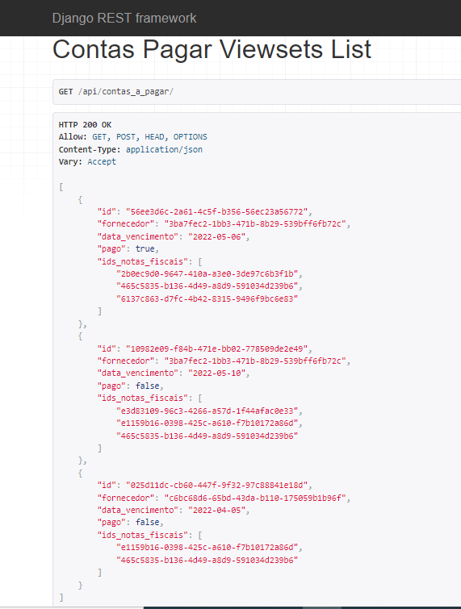
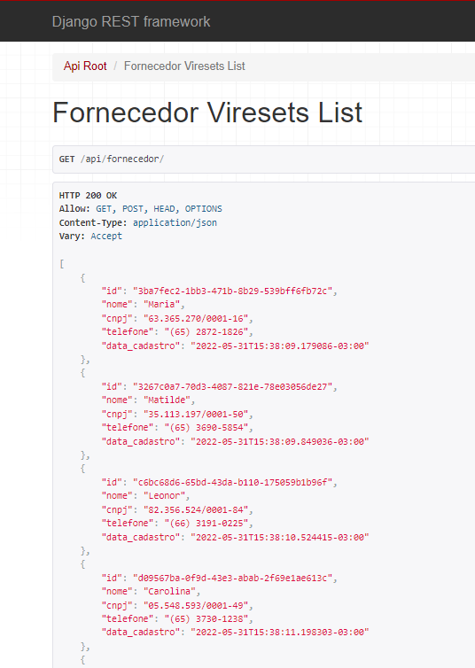
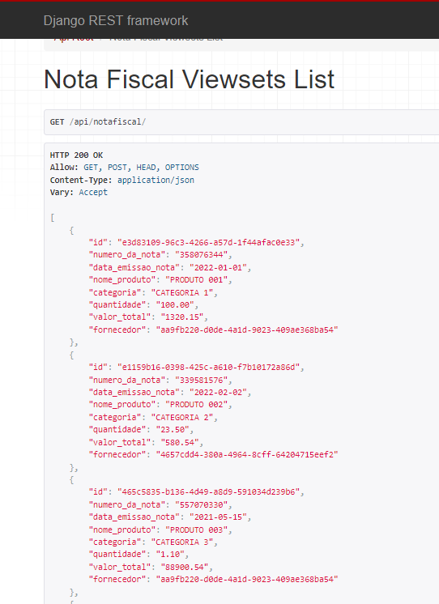

# SELETIVO LUCRO RURAL
## work-at-lucrorural-dev

# Repositorio: https://seletivo-lucrorural.herokuapp.com/

# Passo a passo
**Informações do projeto:**
- API para consumo externa
- Importar csv Fornecedores + Visualidação de dados + delete
- Importar csv Notas fiscais + Visualidação de dados + delete
- Campo de cadastro, editar e deletar Contas a pagar
- Cadastro de usuário e login
- O novo usuário cadastrado entra no grupo cliente, e com isso ele é limitado a algumas funções(não pdoe deletar, os dados CNPJ e CPF não é visivel completamente)
- O usuário ADMIN, pode alterar e deletar informações(Tem acesso visivel a todas as informações)

***Usuario ADMIN: lucasdev | Senha: 123***

***Faça o cadastro de um novo usuário para poder ver as informações cripitografadas***

**Tecnologias**
- Django
- Python
- Postgres
- Heroku
- Bootstrap
- JavaScript
- Css
- Html

**Criar ambiente virtual e Instalar bibliotecas**
~~~ shell
pip install virtualenv
~~~
~~~ shell
python -m venv venv
~~~
~~~ shell
pip install -r requirements.txt
~~~

**Rodar aplicação**

~~~ shell
Python manage.py runserver
~~~

#

## Api Contas a pagar

#
## Api Fornecedor

#
## Api Notas

